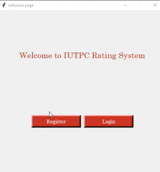
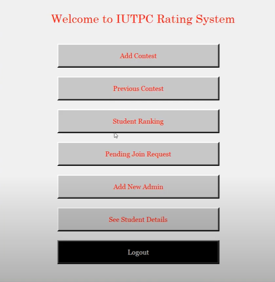
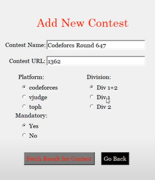
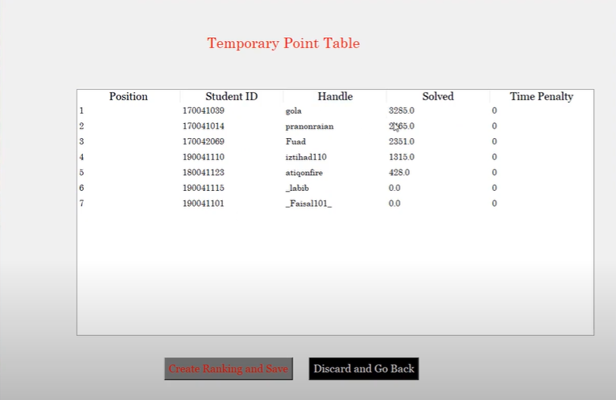
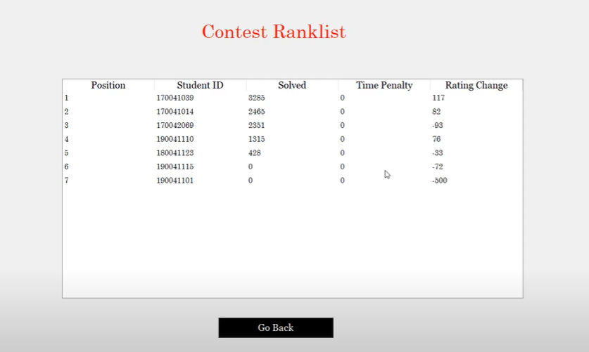

# IUTPC Rating System
Most of the university level programming competitions are organized as a team contest in Bangladesh. Just like all other universities, senior students of IUT also face problem during team formation as a systematic evaluation system for contests are not available. So, we tried to develop this project which could remedy the situation by scraping the ranklist of team formation contest and creating a generalized rating for each student.

This project was developed for our Software Engineering and Relational Database Management System Lab. 
Some of the core features are:

## Key features
- Our system was designed to scrape ranklist from three different judges
-- Codeforces
-- Vjudge
-- Toph
- Our system can ensure division system. It has two divisions for students based on rating. It has facilities to add contests based on division.
- Our system can ensure if the contest is mandatory for some division of students then, if a student does not participate, then he gets penalized
- Our system maintains the division of each student automatically
- After each contest, the system generates a rating based on ELO rating system


## Libraries and Tools
Our project has two modules. Front end User Interface and backend web scraper and rating generator. These modules are explained below:

### User Interface
Our user interface was designed using a python library named ```TKinter```. Tkinter is a hardcoded UI library. Some snapshot for our UI is given below:









### Backend
In our backend, we used ```BeautifulSoup``` for webscraping and ```Cx_Oracle``` for storing data in Oracle Database. We also used ```Oracle Databse``` and ```plSQL``` for procedural SQL. 

## Requirements
1. First install the dependancies. To install dependancies write:
    ``` script 
        pip3 install requirement.txt
    ```
2. Then, to run the project simply run using:
    ```script
        python3 welcomepage.py
    ```
Then the project will be up and running.

## Contributor of this project:
<ul>
<li>Raian Rahman </li>
<li>Rizvi Hasan </li>
<li>Abdullah Al Farhad</li> <br>
Dept. of Computer Science and Engineering <br>
Islamic University of Technology <br>
Dhaka, Bangladesh <br>
</ul>
